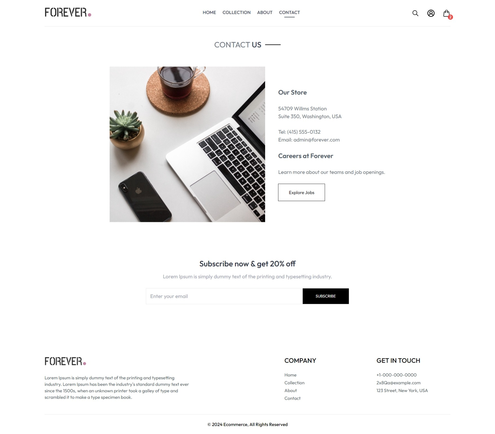
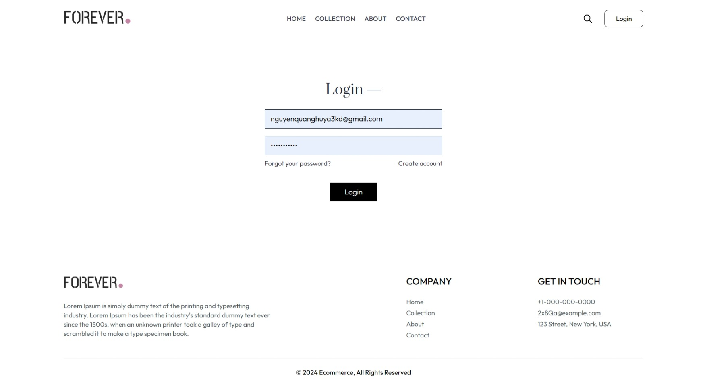
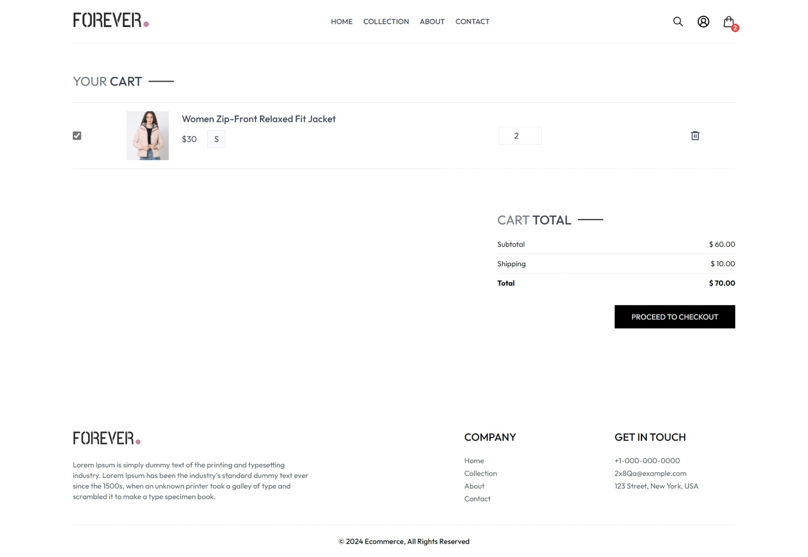
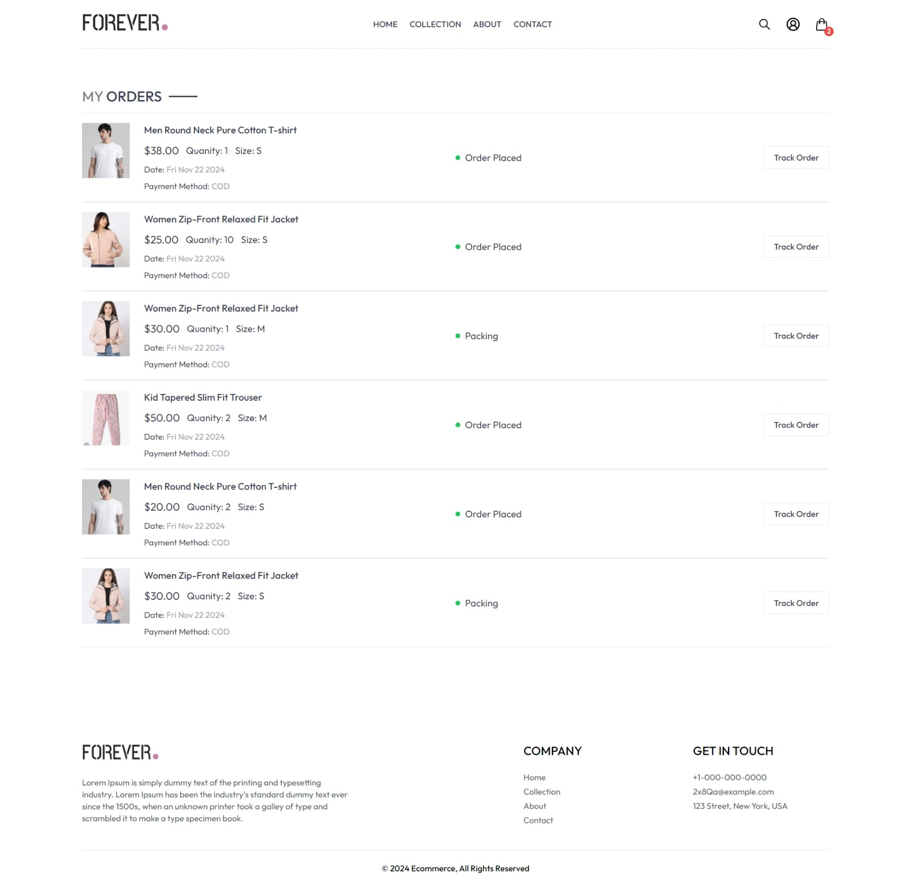
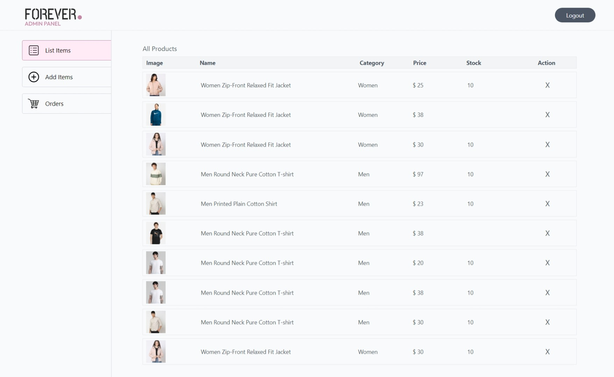
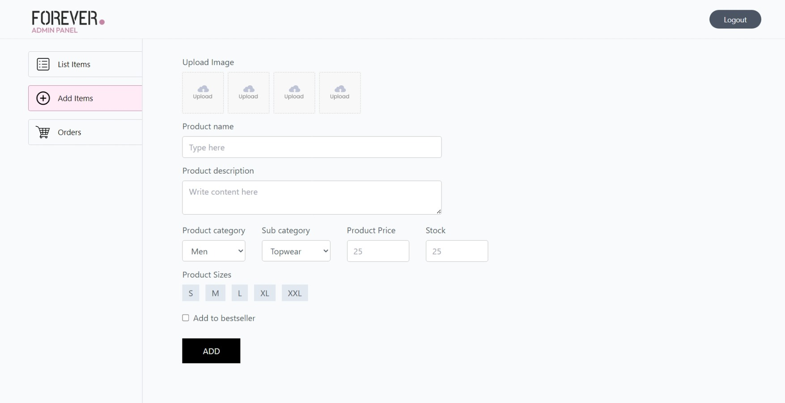
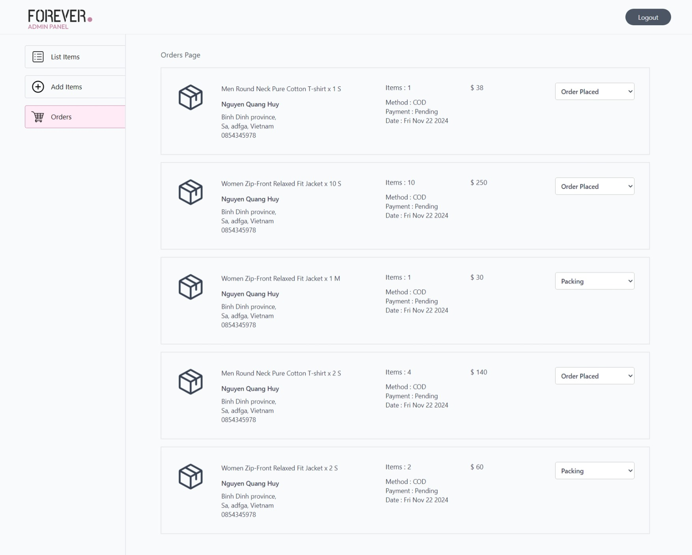

# Ecommerce

Một dự án Ecommerce cho phép người dùng duyệt các sản phẩm, thêm vào giỏ hàng, đặt hàng và theo dõi lịch sử mua sắm. Dự án bao gồm các chức năng quản lý sản phẩm và đơn hàng cho admin.

## Giao Diện

Dưới đây là một số hình ảnh của giao diện web của dự án:

### Trang Chủ


### Trang Chi Tiết Sản Phẩm


### Trang Liên Hệ (Contact)



### Trang Đăng Nhập (Login)



### Giỏ Hàng (Cart)



### Lịch Sử Đơn Hàng (History Order)



### Quản Lý Sản Phẩm (Admin)



### Thêm Sản Phẩm (Admin)



### Quản Lý Đơn Hàng (Admin)



## Cài Đặt

Hướng dẫn cài đặt dự án của bạn.

1. Clone repo:

   ```bash
   git clone https://github.com/QuangHuy231/Ecommerce.git
   ```

2. Cài đặt các phụ thuộc:

   ```bash
    cd ./frontend
    npm install

    cd ./backend
    npm install

    cd ./admin
    npm install

   ```

3. Khởi chạy backend, frontend, admin

   ```bash
    cd ./backend
    npm start

    cd ./frontend
    npm run dev

    cd ./admin
    npm run dev
   ```

## Các Tính Năng

Website thương mại điện tử bao gồm các tính năng chính sau:

### Trang Chủ:

Hiển thị các sản phẩm nổi bật và các mục khác như "about us", "contact".

### Tất Cả Sản Phẩm (All Products):

Hiển thị danh sách sản phẩm của cửa hàng.

### Chi Tiết Sản Phẩm (Product Detail):

Hiển thị thông tin chi tiết về sản phẩm khi người dùng click vào.

### Giỏ Hàng (Cart):

Cho phép người dùng xem sản phẩm đã chọn và tổng giá trị giỏ hàng.

### Lịch Sử Đơn Hàng (Order History):

Người dùng có thể xem lại các đơn hàng trước đây của họ.

### Đặt Hàng (Place Order):

Người dùng có thể hoàn tất các bước thanh toán và đặt hàng.

### Đăng Nhập (Login):

Hệ thống quản lý tài khoản người dùng.

### Quản Lý Sản Phẩm (Admin):

Admin có thể thêm, sửa, xóa sản phẩm.

### Quản Lý Đơn Hàng (Admin):

Admin có thể xem và quản lý các đơn hàng của khách hàng.

### Thêm Sản Phẩm (Admin):

Admin có thể thêm sản phẩm mới vào hệ thống.
